🚀 TikTok Direct Uploader: No Third-Party Middleware
This n8n workflow provides a native, direct connection between your files and the TikTok Content Posting API. 
It eliminates the need for any third-party automation services, communicating directly with TikTok's official servers for maximum security and control.

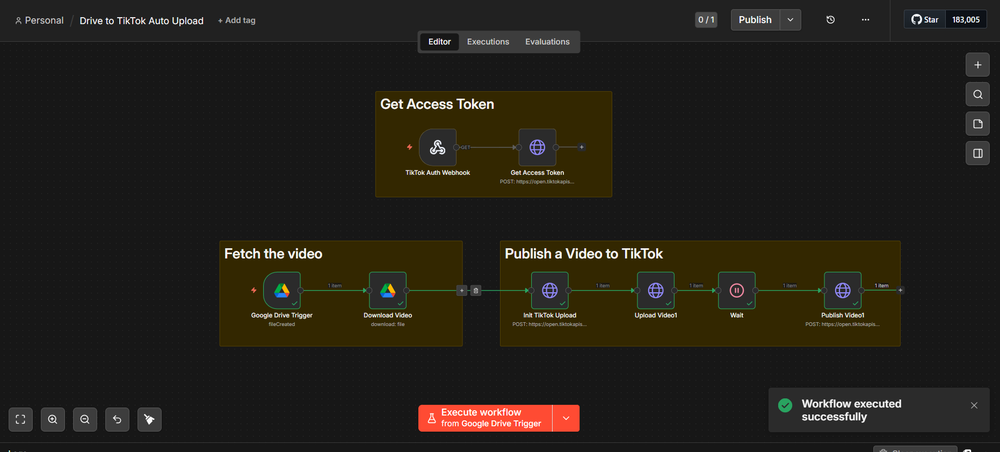

🛠 Detailed Technical Steps

1. Authorization Phase (OAuth 2.0)

•	Webhook Listener: The workflow starts with a Webhook node (tiktok-auth) to receive the authorization code.

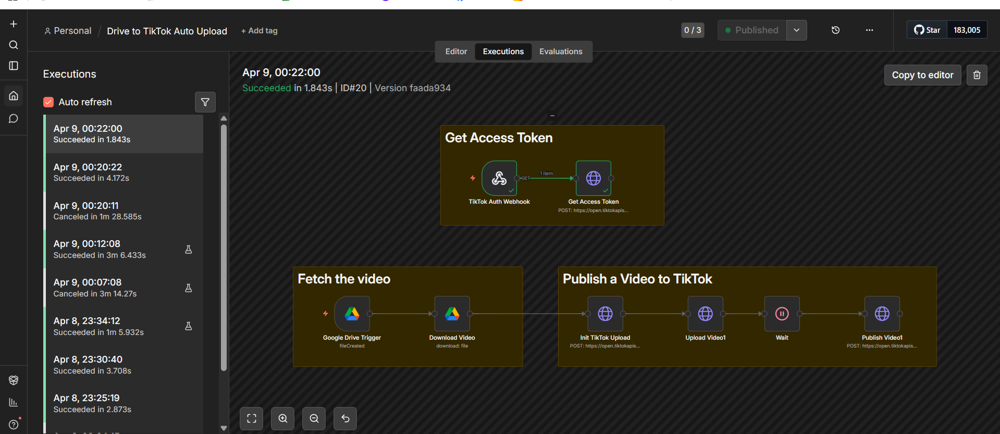

 This is triggered by visiting your custom authorization URL.
 
o	Authorization URL Template:
https://www.tiktok.com/v2/auth/authorize/?client_key=YOUR_CLIENT_KEY&scope=video.upload,video.publish,user.info.basic&response_type=code&redirect_uri=YOUR_CALLBACK_URL

•	Token Exchange: Once the code is received, the workflow automatically sends a POST request to https://open.tiktokapis.com/v2/oauth/token/ to exchange it for a secure Access Token.

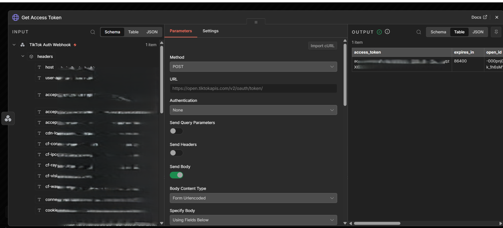

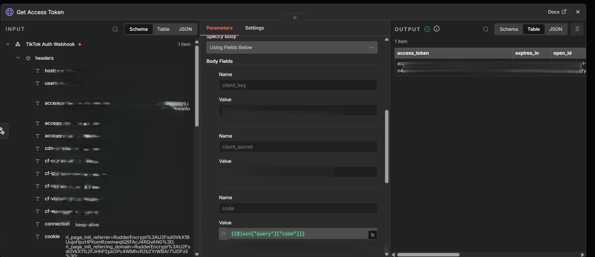

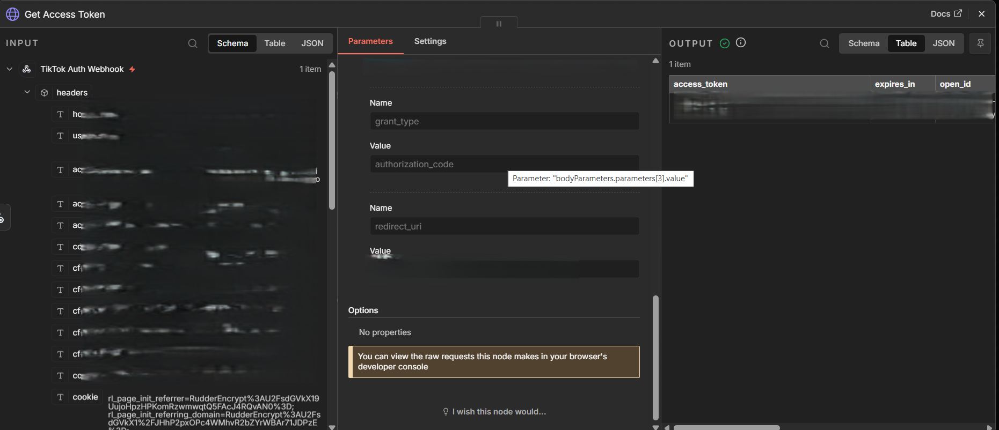

3. Trigger & Retrieval

•	Folder Monitoring: The Google Drive Trigger polls a specific folder ID every minute to detect new video uploads.

•	Binary Download: Once a file is detected, the Download Video node fetches the file and converts it into binary data, preparing it for a direct stream to TikTok.

4. The Multi-Step Upload Process & Inbox Verification

•	Initialization: The Init TikTok Upload node contacts the TikTok API to declare the file size and intent to upload. It receives a unique upload_url.

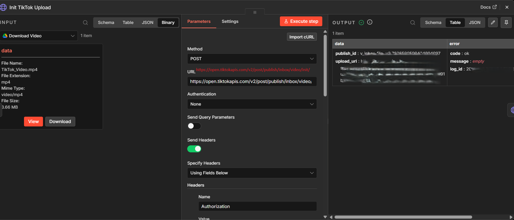

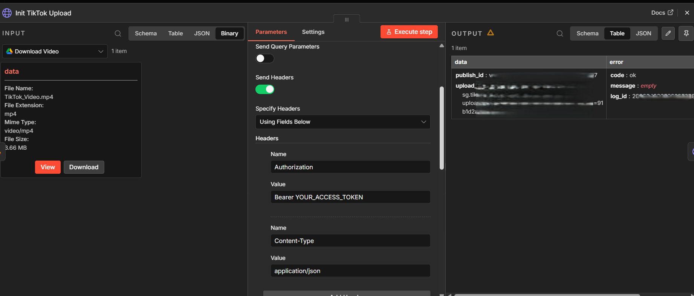

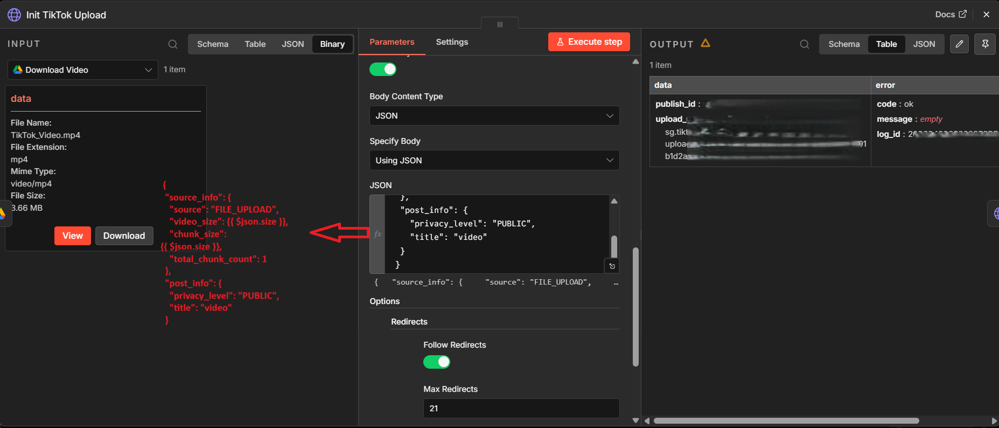

•	Binary Stream Upload: The Upload Video node performs a PUT request directly to that URL. It uses the Content-Range header to ensure the binary data is transmitted according to TikTok's official API specifications.

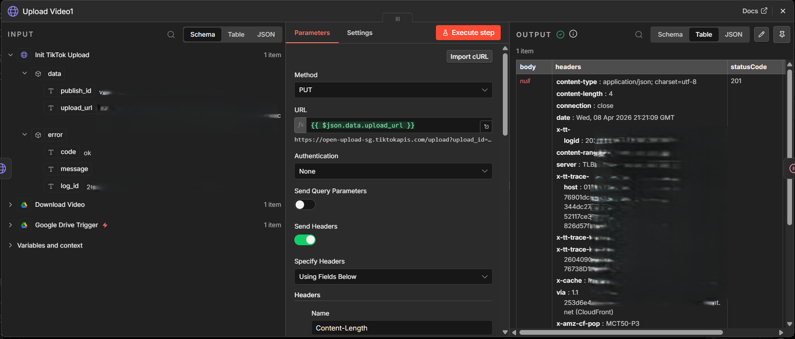

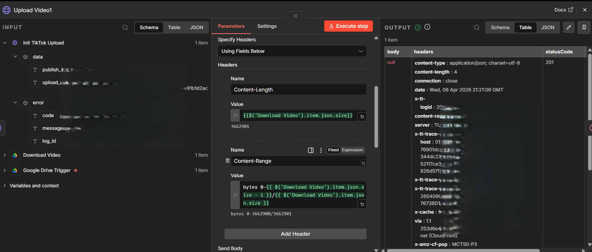

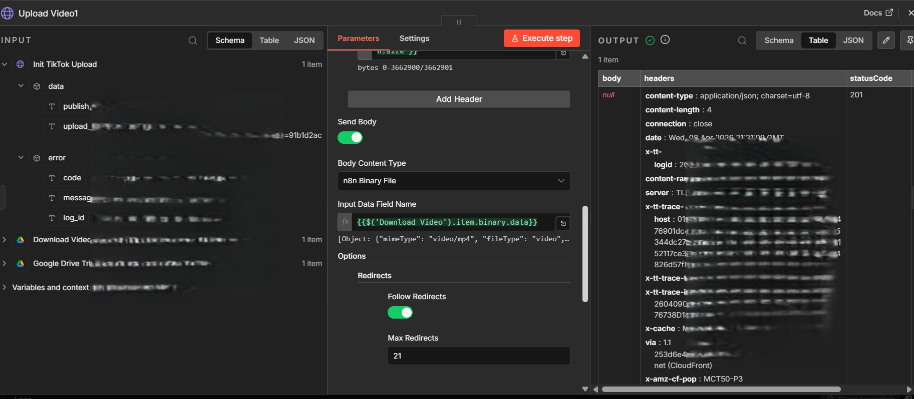

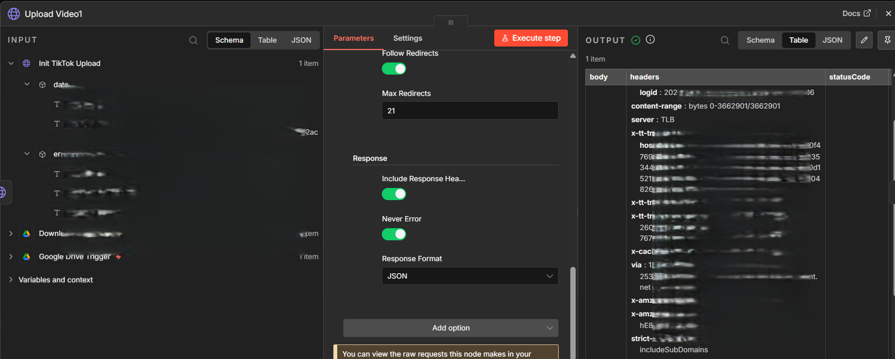

•	Verification & Inbox Status: The Publish Video node sends a final request to check the status.

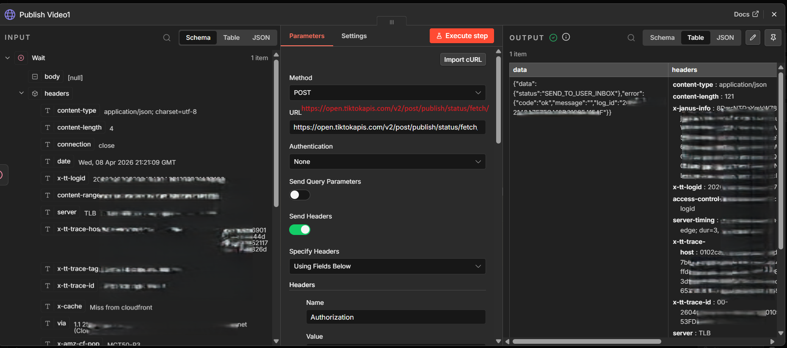

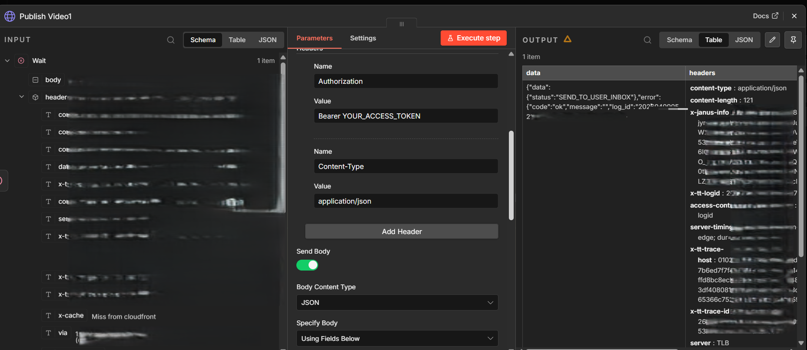

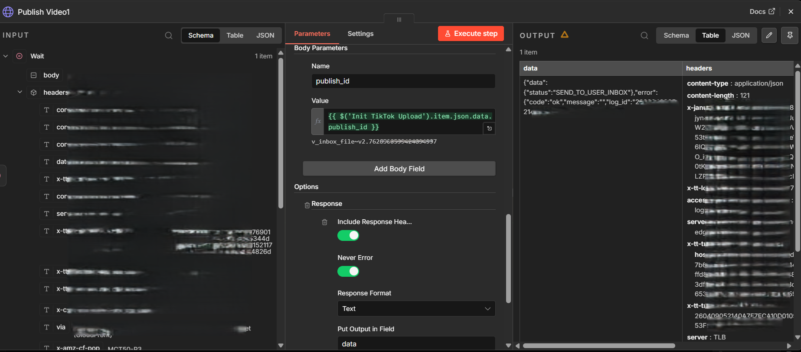

o	SEND_TO_USER_INBOX Status: When the workflow returns this status, it confirms the video has been successfully processed and delivered to your TikTok account.

o	Final Step: For security, TikTok places API-uploaded videos in your App Inbox/Activity. 
Simply open your TikTok app, find the notification, and confirm the post to make it live.
________________________________________
🚀 Setup Instructions

1.	Import: Import the Drive to TikTok Auto Upload.json file into your n8n instance.

2.	Credentials:
o	Set up your Google Drive OAuth2 credentials in n8n.
o	Replace the client_key and client_secret in the HTTP nodes with your details from the TikTok Developer portal.

3.	Webhook: Update your TikTok App's Redirect URI in the developer console to match your n8n Webhook URL.

